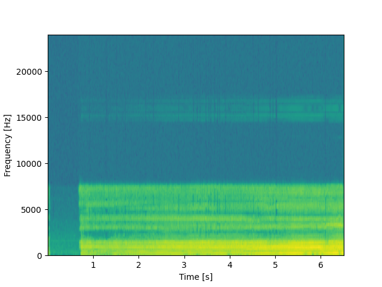
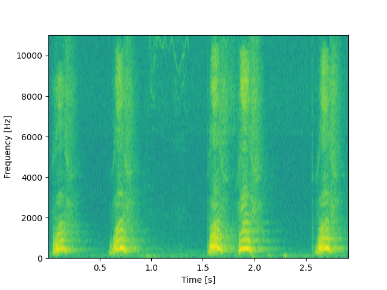
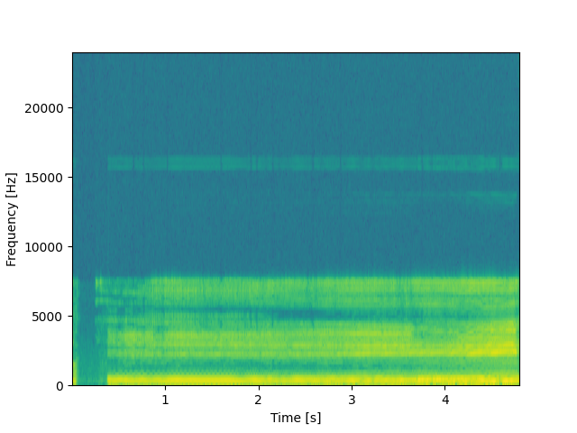

# Отчет по звуковым файлам

## File: a.wav

- **Min frequency:** 750.0
- **Max frequency:** 24000.0
- **The most timbrally colored fundamental tone:** 897
- **The three most prominent peaks in the spectrogram:** [3187.5, 187.5, 750.0]

---

## File: dog.wav

- **Min frequency:** 516.796875
- **Max frequency:** 11025.0
- **The most timbrally colored fundamental tone:** 378
- **The three most prominent peaks in the spectrogram:** [947.4609375, 775.1953125, 516.796875]

---

## File: i.wav

- **Min frequency:** 187.5
- **Max frequency:** 11250.0
- **The most timbrally colored fundamental tone:** 721
- **The three most prominent peaks in the spectrogram:** [2812.5, 2250.0, 187.5]
