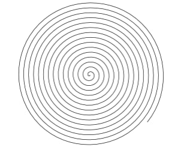
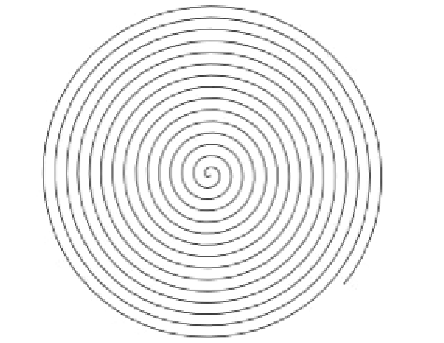
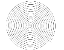
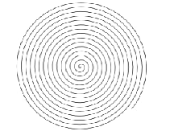
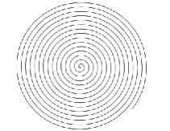

# Передискретизация

## Исходное изображение

## Растяжение (интерполяция) изображения в M раз

## Сжатие (децимация) изображения в N раз

## Передискретизация изображения в K=M/N раз путём растяжения и последующего сжатия (в два прохода)

## Передискретизация изображения в K раз за один проход

