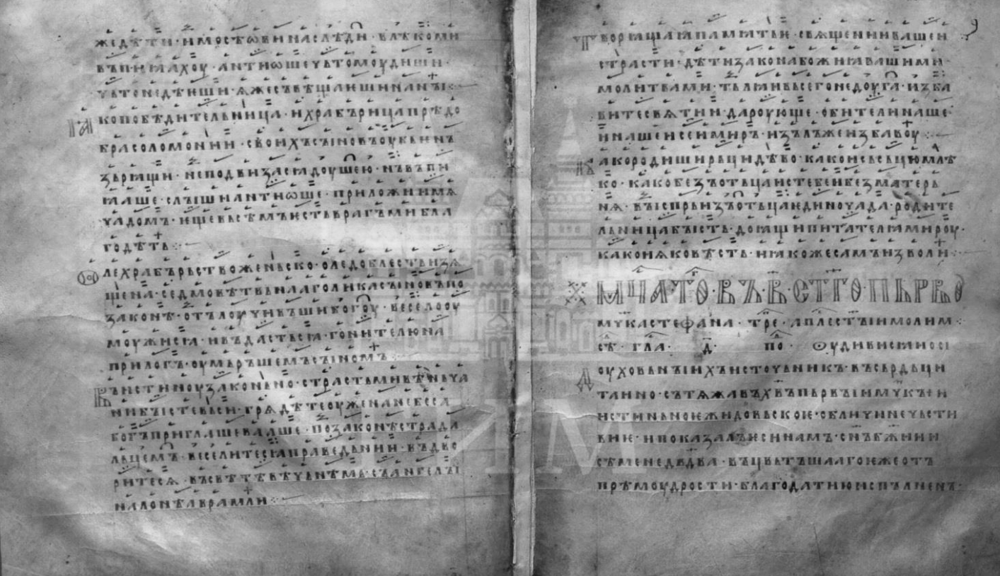
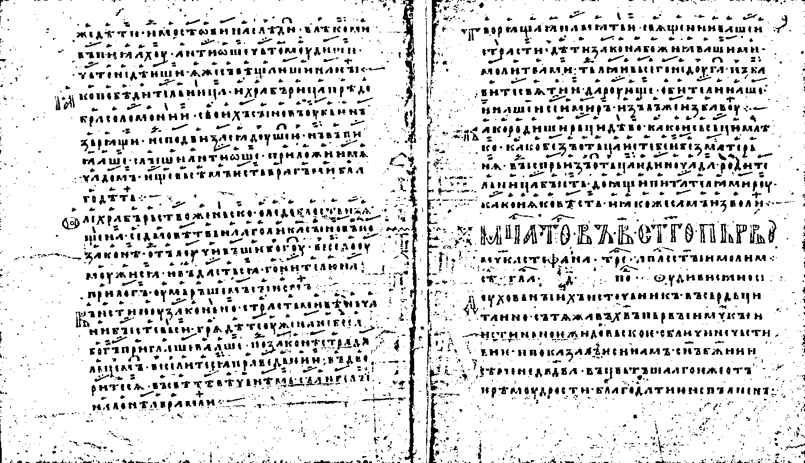
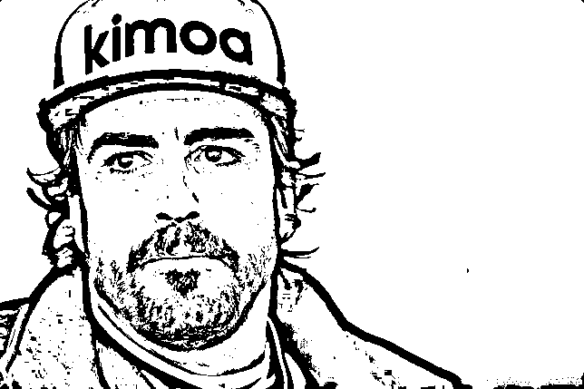

# Лабораторная работа №2. Бинаризация изображений (Алгоритм адаптивной бинаризации Брэдли и Рота.)

## Первое изображение

### Исходное изображение

### Полутоновое изображение

### Бинаризованное изображение

## Второе изображение

### Исходное изображение

### Полутоновое изображение

### Бинаризованное изображение

## Третье изображение

### Исходное изображение

### Полутоновое изображение

### Бинаризованное изображение

## Изображение человеческого лица

### Исходное изображение

### Полутоновое изображение

### Бинаризованное изображение

