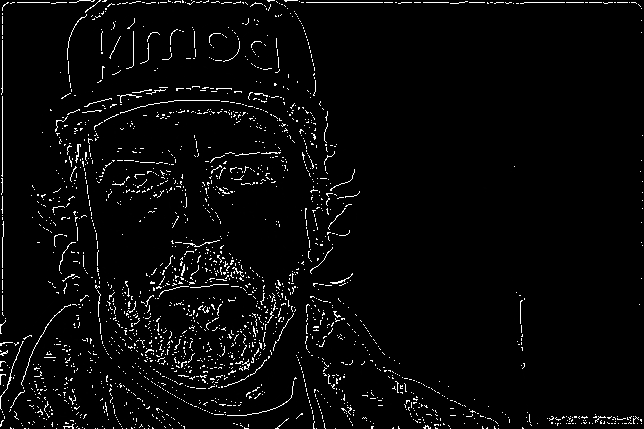
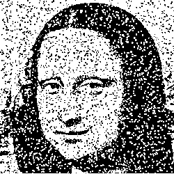

# Лабораторная работа №3. Фильтрация изображений и морфологические операции(Фильтрация ранговым фильтром)

## Первое изображение

### Исходное изображение

### фильтрация

-размер окна 5, порог ранга 10

### разностное изображение

## Второе изображение

### Исходное изображение

### фильтрация

### разностное изображение

## Третье изображение

### Исходное изображение

### фильтрация

### разностное изображение

## Изображение человеческого лица 1

### Исходное изображение

### фильтрация

### разностное изображение

## Изображение человеческого лица 2

### Исходное изображение

### фильтрация

### разностное изображение

---

## Изображение дома

### Исходное изображение

### фильтрация

### разностное изображение

