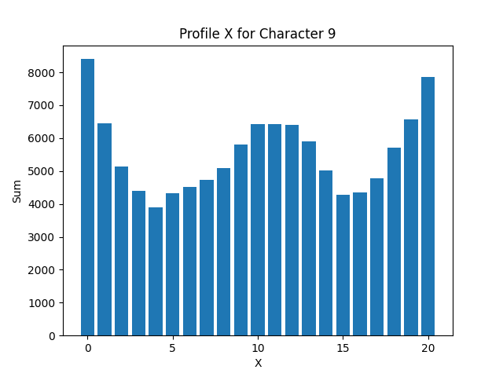
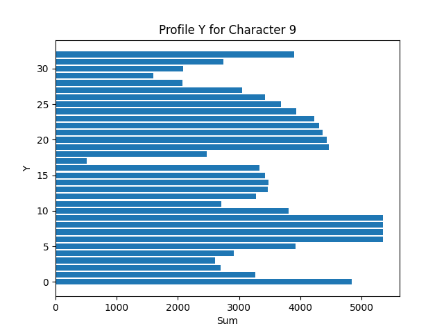
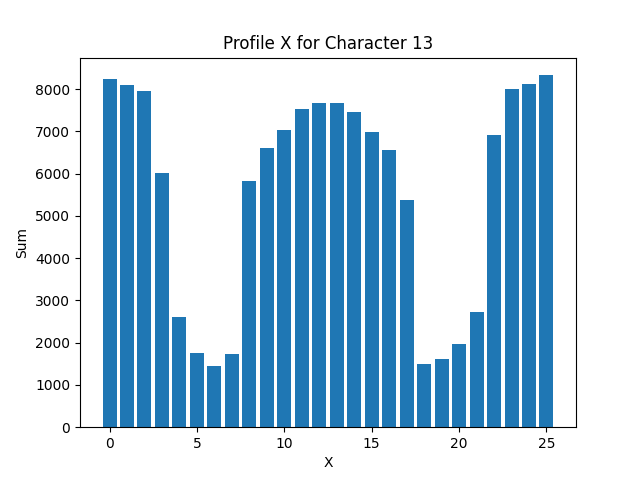
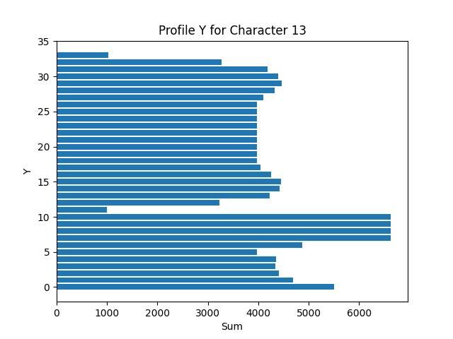
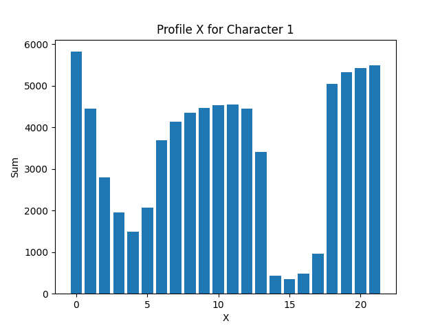
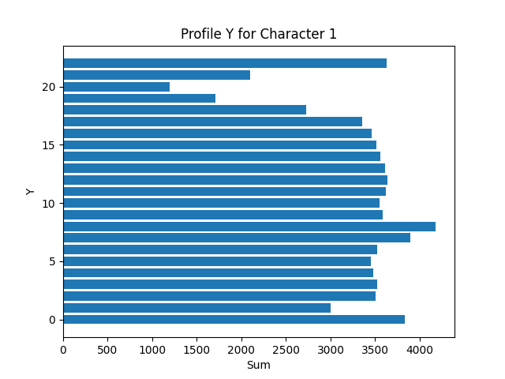
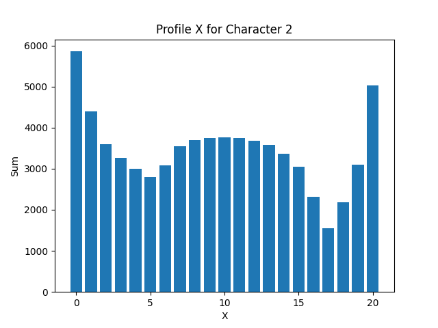
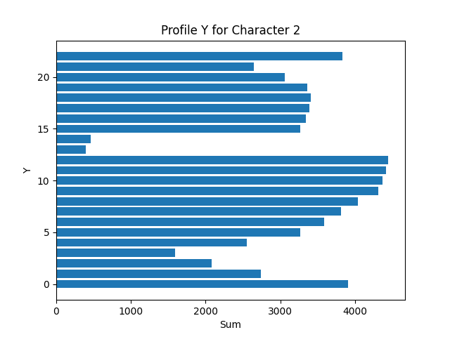

# Лабораторная работа №5. Выделение признаков символов

## Буква Ё

 

- Вес (масса чёрного) каждой четверти изображения символа = 38,55,88,62
- Удельный вес (вес, нормированный к четверти площади) = 0.2375,0.3125,0.5176470588235295,0.3315508021390374
- Координаты центра тяжести = 9.786008230452675,17.7119341563786
- Нормированные координаты центра тяжести = 0.4660003919263178,0.5367252774660182
- Осевые моменты инерции по горизонтали и вертикали = 7250.872427983539,21847.8353909465
- Нормированные осевые моменты инерции = 0.06766208885514159,0.08256087017177574

## Буква І

 

- Вес (масса чёрного) каждой четверти изображения символа = 20,28,40,58
- Удельный вес (вес, нормированный к четверти площади) = 0.18518518518518517,0.2222222222222222,0.37037037037037035,0.4603174603174603
- Координаты центра тяжести = 5.917808219178082,21.335616438356166
- Нормированные координаты центра тяжести = 0.45521601685985247,0.5926560121765602
- Осевые моменты инерции по горизонтали и вертикали = 435.013698630137,15212.554794520549
- Нормированные осевые моменты инерции = 0.017630449000167667,0.08039782467931121

## Буква А

 

- Вес (масса чёрного) каждой четверти изображения символа = 38,51,59,61
- Удельный вес (вес, нормированный к четверти площади) = 0.3140495867768595,0.4214876033057851,0.44696969696969696,0.4621212121212121
- Координаты центра тяжести = 10.440191387559809,11.913875598086124
- Нормированные координаты центра тяжести = 0.4745541539799913,0.5179945912211358
- Осевые моменты инерции по горизонтали и вертикали = 6569.502392344498,10278.44976076555
- Нормированные осевые моменты инерции = 0.06494426818324665,0.09296632411759617

## Буква Б

 

- Вес (масса чёрного) каждой четверти изображения символа = 65,71,87,78
- Удельный вес (вес, нормированный к четверти площади) = 0.30092592592592593,0.3034188034188034,0.4027777777777778,0.3333333333333333
- Координаты центра тяжести = 11.548172757475083,17.963455149501662
- Нормированные координаты центра тяжести = 0.4619269102990033,0.49898486526393504
- Осевые моменты инерции по горизонтали и вертикали = 14702.55149501661,33086.59800664452
- Нормированные осевые моменты инерции = 0.07815309764792883,0.08481655286556262
