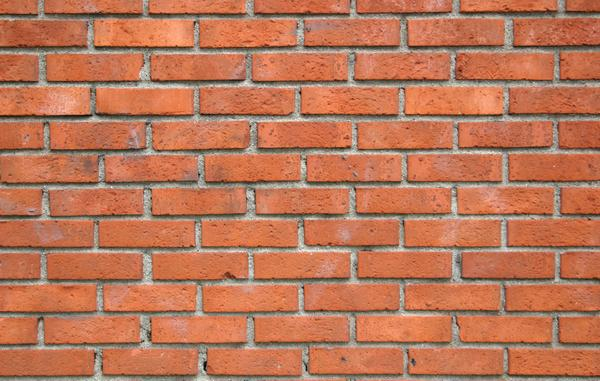

# Лабораторная работа №8. Текстурный анализ и контрастирование.

## Изображение кирпичной стены

### Исходное:

### Полутоновое:

### Матрица Харалика

### Признаки

CON: 3014811915.036437

LUN: 77291.61203430594

### Гистограммы

### Контрастированное изображение

### Матрица Харалика для контрастированного изображения

### Контрастированные признаки

CON (contrasted): 15597715390.454166  
LUN (contrasted): 43808.00649088154
